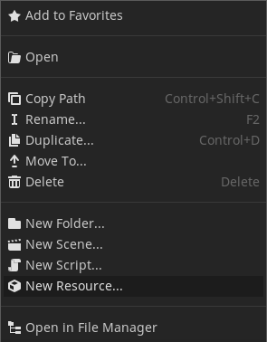
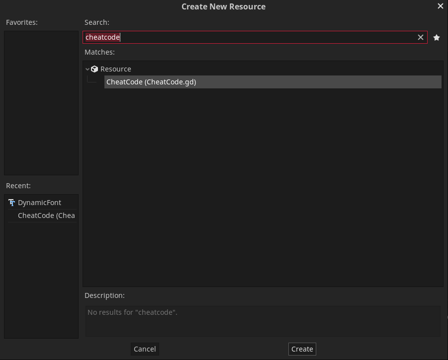
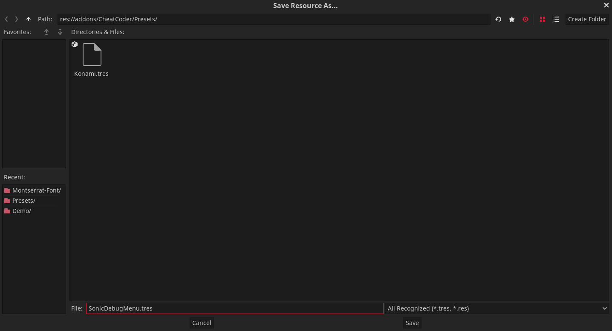
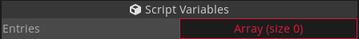
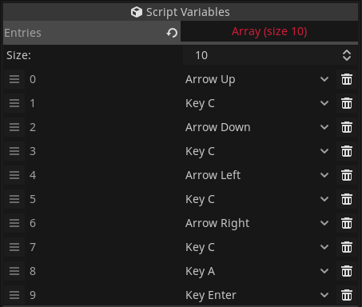
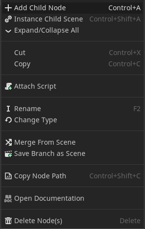
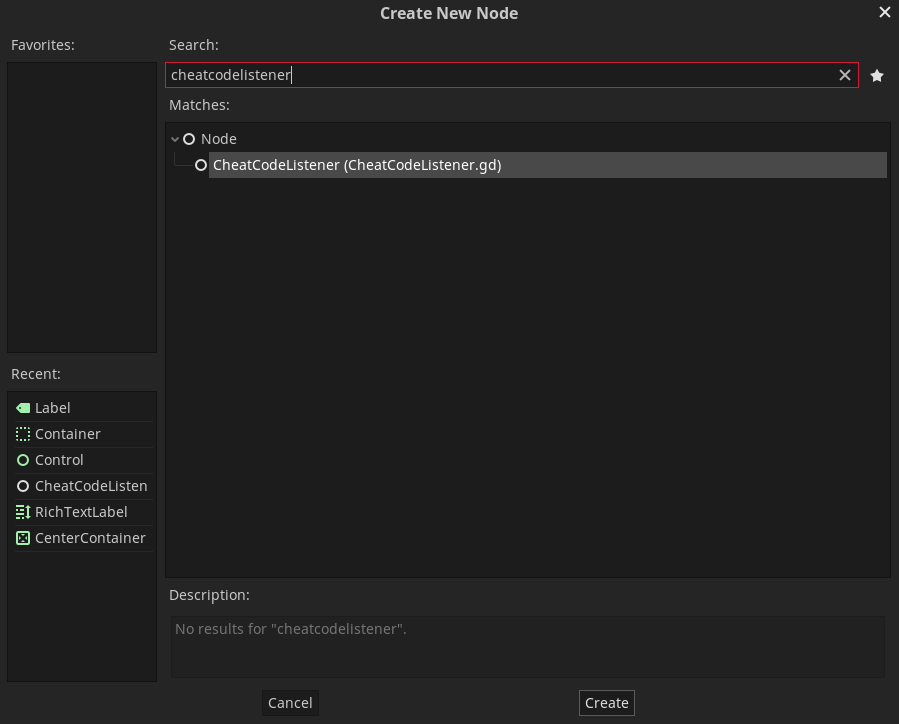
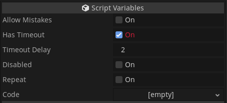
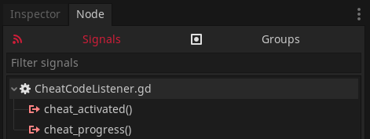

# CheatCoder

- [CheatCoder](#cheatcoder)
  - [Installation](#installation)
    - [Automatic](#automatic)
    - [Manual](#manual)
  - [Usage](#usage)
  - [Demo](#demo)

Add cheat codes to your game with just a few clicks

## Installation

### Automatic

> WARNING: This method is not yet available, as it is not yet approved for the asset library.

- Search "CheatCoder" in the Asset Library
- Click Download, then install
- In `Project Settings` > `Plugins` set `CheatCoder` to `Enabled`

### Manual

- Copy the `CheatCoder` folder (inside `addons`) and paste it in your project's `addons` folder (folder **must** be named exactly `addons`, otherwise godot wont detect it)
- Enable the addon inside Project > Project Settings > Plugins > Click `Enable` for the CheatCoder plugin

## Usage

Creating a cheat code

Cheat codes are just resources, which means they are stored in the filesystem. To create one, just add a resource of type CheatCode:

Double-clicking it in the inspector reveals a single property: "entries". This is a list of keys that will need to be pressed in the correct order to activate the cheat code.

Now set how many buttons it will contain:

And fill it with whatever you want:

Listening for the cheat code

Now that you've created a cheat code, it's time to use it. A `CheatCodeListener` node checks for player input matching the cheat code, and will emit a signal when it's a match. So, add a `CheatCodeListener` node:

The node has some values you can tweak, here is a brief overview:

| Name             | Description                                                                        | Default |
| :--------------- | :--------------------------------------------------------------------------------- | :-----: |
| `allow_mistakes` | If this is checked, the listener will ignore keys that don't match the cheat code  | `false` |
| `has_timeout`    | If no matching key is pressed within [`timeout_delay`] seconds, it will start over | `true`  |
| `timeout_delay`  | See description for `has_timeout`                                                  |  `2.0`  |
| `disabled`       | This explains itself...                                                            | `false` |
| `repeat`         | When `false`, the cheat code can only be activated once.                           | `false` |
| `code`           | Put your CheatCode in here                                                         | `null`  |

Now add the cheat code you just created:

res/htu-step-10.mp4

You can now connect these signals to whatever function you please:

 | Name              | Use                                                                                                            | Signature                          |
 | :---------------- | :------------------------------------------------------------------------------------------------------------- | :--------------------------------- |
 | `cheat_activated` | Fired when the full cheat  code was executed                                                                | `func name() -> void`              |
 | `cheat_progress`  | Fires when the correct  key is pressed. Also   fires `progress = 0`   when a wrong key is  pressed | `func name(progress: int) -> void` |

## Demo

To see CheatCoder in action, click [here](https://hugo4it.com/files/CheatCoderDemo/)